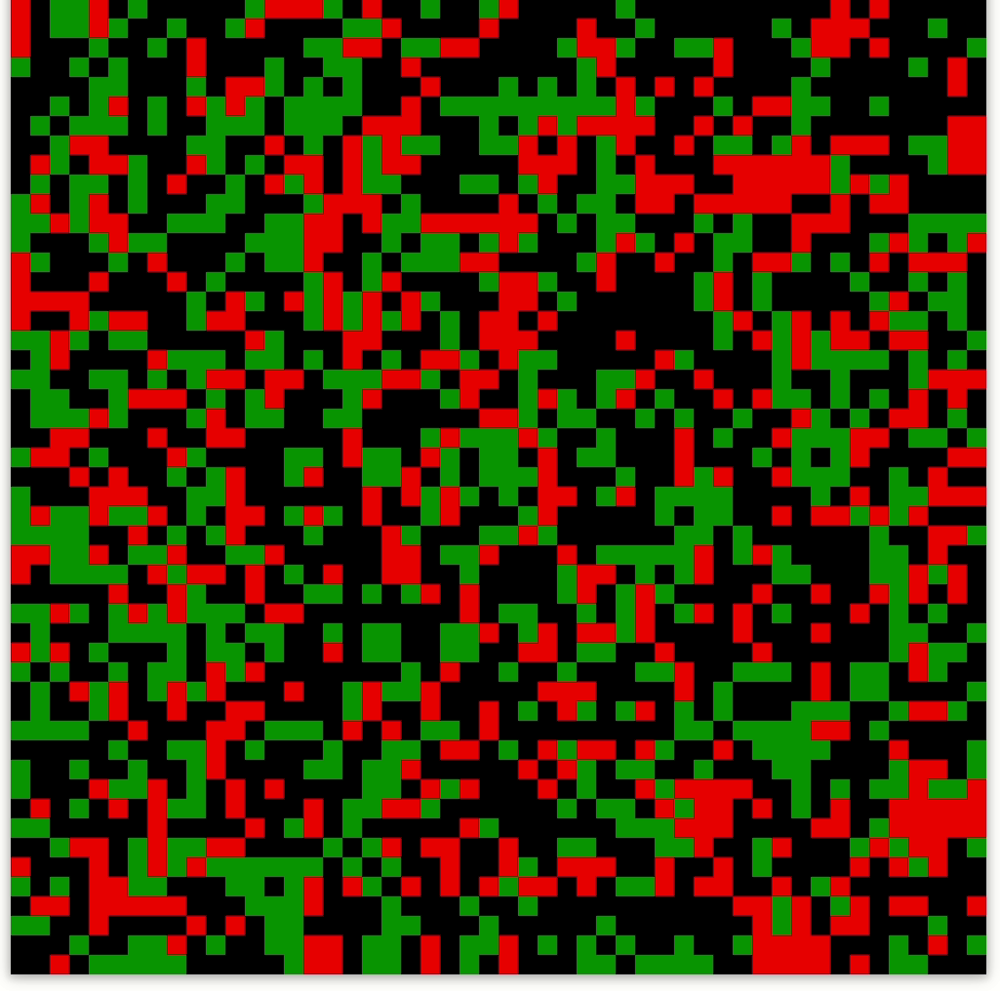
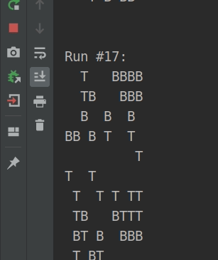

# ForestFireModel
Implementation of the Drossel and Schwabl definition of the [forest fire model](https://en.wikipedia.org/wiki/Forest-fire_model) on a 2 dimensional grid.

Each cell in the grid can be in one of three distinct states: empty, burning and tree.

The cell evolves according to the following rules:
* A burning cell turns into an empty cell
* A tree will burn if at least one neighbour is burning
* A tree ignites with a given probability even if no neighbour is burning
* An empty space fills with a tree with a given probability

## Demo
### GUI
An example of the simulation running with a one second delay between evolutions.

Utilises multi threading so the JavaFX application thread is not being blocked all the time.

Cell states are represented by the following three states colours:
* Green = Tree
* Red = Burning Tree
* Black = Unoccupied

### CLI
An example of the simulation running with a half second delay between evolutions.

Cell states are represented by the following three states:
* T = Tree
* B = Burning Tree
* Blank Cell = Unoccupied

